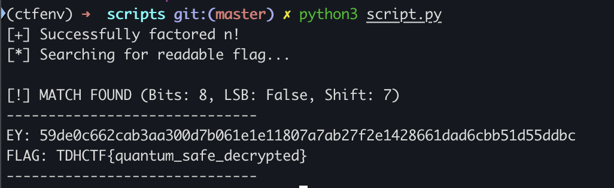

## CRYPTO 03: QUANTUM SAFE

description: The Directorate's RSA vault uses poor padding. The crew factors it and extracts the master key index, giving theoretical access to the Digital Vault. The final heist phase begins.

files: 1337crypt_output.txt, README.txt

**1337crypt_output.txt**

    hint = 10822409793003891926479667883064476588374205388459006377576921558660420289299563346864356663264650103768361830980033485586048754551736884144151937482084596554999310896697060324283748426254802775607141401218747134058584565105773176919434387467106322126139590567162820891053072154485087581443243177010686013691878581754116248627510726084040557717095956784126021264495711736218225625521709860275986662765655857292866115035281180143374189380795482843220397845159440899619525525149780750697727931595123998924146619576305
    D = 4103370446197208794390033281185342639792945427100989874973770067537073996909731735182092558277489516334869534164401530606723845163373939437803091196905592111085537413441267233079578478955779924378498642758422287372525258877435744350320574223099198482028712597066625723069244073042724783566461954077855878527324001
    n = 3008624689301128344720248665448473368396584960152551450700351510047727186242931426749434404489155183059839698840933029650837685151240632287089850765852440879950952904845519882707413454254238100513846185963834453512156243914379146445421922028357179587412666667867579500330274333694343566104228309510355961864280715869416884442913875474998601645049763322331934407349773878732400179045692725966833033938998884420617971550189001860004671270921203625122758682556550114495994895747074428357146148578012928887356061254157705979313332760237130461173839609644627321465439566006260924837751026303742067252336781117008401058409493841478798438900396767205418419557528226014932212657902200409237997370357222069921564539785341933025351693409661979700065099985792558118930505492236845051262766784707404540906235555437357
    c = [huge array of ciphertexts ...]

**README.txt**

    === CRYPTO-03: Quantum-Safe Vault ===

    MISSION:
    Break the advanced Goldwasser-Micali encryption in 1337crypt_output.txt
    
    INTELLIGENCE:
    - 1337-bit RSA primes (extremely large!)
    - Goldwasser-Micali probabilistic encryption
    - Encrypts flag bit-by-bit using quadratic residuosity
    - Mathematical hint provided: hint = D * (√p + √q)
    
    VULNERABILITY:
    The hint leaks information about the prime factors!
    
    ATTACK STRATEGY:
    1. Use the hint to factor n:
       - Calculate s = hint / D
       - s = √p + √q
       - Use algebra: s² = p + q + 2√n
       - Solve quadratic equation with p*q = n
    
    2. Decrypt each ciphertext bit using Legendre symbols:
       - legendre(c, p) = 1  →  bit is 0
       - legendre(c, p) = -1 →  bit is 1
    
    3. Convert bits back to string to reveal flag
    
    TOOLS NEEDED:
    - SageMath (for advanced number theory)
    - Deep understanding of:
      * RSA mathematics
      * Legendre symbols
      * Quadratic residuosity
      * Goldwasser-Micali encryption
    
    OBJECTIVE:
    Factor n, decrypt bit-by-bit to reveal TWO values:
    1. Key - The cryptographic key
    2. Flag - The mission flag (TDHCTF{...})
    
    The decrypted message will be in the format:
    KEY: <key>
    FLAG: <flag>
    
    This is the ultimate crypto challenge. Good luck!

technically everything that you need to do is already given in the readme file and the only thing where i kind of got stuck was that the bit decryption given in the readme is actually the opposite of what decrypts the ciphertext. so its actually:

    - legendre(c, p) = 1  →  bit is 1
    - legendre(c, p) = -1 →  bit is 0

another place where one might get stuck is that `hint` is not perfectly divisible by `D` and so the valued of p and q are not accurate. 

AI worked for me in this one for writing the script and this is the script that gemini outputted which gave me the solution. 

code gemini gave:

    import math
    import re
    from decimal import Decimal, getcontext
    
    # Set precision for 1337-bit numbers
    getcontext().prec = 1000
    
    def solve_quantum_vault():
        # --- DATA ---
        hint = 10822409793003891926479667883064476588374205388459006377576921558660420289299563346864356663264650103768361830980033485586048754551736884144151937482084596554999310896697060324283748426254802775607141401218747134058584565105773176919434387467106322126139590567162820891053072154485087581443243177010686013691878581754116248627510726084040557717095956784126021264495711736218225625521709860275986662765655857292866115035281180143374189380795482843220397845159440899619525525149780750697727931595123998924146619576305
        D_val = 4103370446197208794390033281185342639792945427100989874973770067537073996909731735182092558277489516334869534164401530606723845163373939437803091196905592111085537413441267233079578478955779924378498642758422287372525258877435744350320574223099198482028712597066625723069244073042724783566461954077855878527324001
        n = 3008624689301128344720248665448473368396584960152551450700351510047727186242931426749434404489155183059839698840933029650837685151240632287089850765852440879950952904845519882707413454254238100513846185963834453512156243914379146445421922028357179587412666667867579500330274333694343566104228309510355961864280715869416884442913875474998601645049763322331934407349773878732400179045692725966833033938998884420617971550189001860004671270921203625122758682556550114495994895747074428357146148578012928887356061254157705979313332760237130461173839609644627321465439566006260924837751026303742067252336781117008401058409493841478798438900396767205418419557528226014932212657902200409237997370357222069921564539785341933025351693409661979700065099985792558118930505492236845051262766784707404540906235555437357
        c = [ciphertexts]
    
        # --- FACTORING ---
        s_dec = Decimal(hint) / Decimal(D_val)
        # gemini cleverly rounds the float to the nearest decimal here
        sum_pq = int(round(s_dec**2 - 2 * Decimal(n).sqrt()))
        
        diff_sq = Decimal(sum_pq**2 - 4 * n).sqrt()
        p = int(round((Decimal(sum_pq) + diff_sq) / 2))
        q = n // p
    
        if p * q != n:
            print("[-] Factoring failed. Please check the input values.")
            return
        print(f"[+] Successfully factored n!")
    
        # --- BIT EXTRACTION ---
        # legendre(c, p) == 1  -> bit 0
        # legendre(c, p) == -1 -> bit 1
        bits = []
        for c in cts:
            if pow(c, (p - 1) // 2, p) == 1:
                bits.append(1)
            else:
                bits.append(0)
    
        # --- BRUTE-FORCE ALIGNMENT ---
        print("[*] Searching for readable flag...")
        
        def decode_bits(bit_list, lsb=True, step=8):
            chars = ""
            for i in range(0, len(bit_list), step):
                chunk = bit_list[i:i+step]
                if len(chunk) < step: break
                s = "".join(map(str, chunk))
                if lsb: s = s[::-1]
                chars += chr(int(s, 2))
            return chars
    
        # Try every combination of LSB/MSB, 7-bit/8-bit, and bit-shifts
        for bit_len in [8, 7]:
            for is_lsb in [True, False]:
                for shift in range(bit_len):
                    candidate = decode_bits(bits[shift:], lsb=is_lsb, step=bit_len)
                    
                    # Check for common flag formats or keywords
                    if "KEY" in candidate or "TDHCTF" in candidate or "FLAG" in candidate:
                        print(f"\n[!] MATCH FOUND (Bits: {bit_len}, LSB: {is_lsb}, Shift: {shift})")
                        print("-" * 30)
                        print(candidate)
                        print("-" * 30)
                        return
    
        print("[-] Could not find a clean flag. Try swapping legendre bit logic (0 <-> 1).")
    
    if __name__ == "__main__":
        solve_quantum_vault()

output: 

flag: `TDHCTF{quantum_safe_decrypted}`
key: `59de0c662cab3aa300d7b061e1e11807a7ab27f2e1428661dad6cbb51d55ddbc`

    